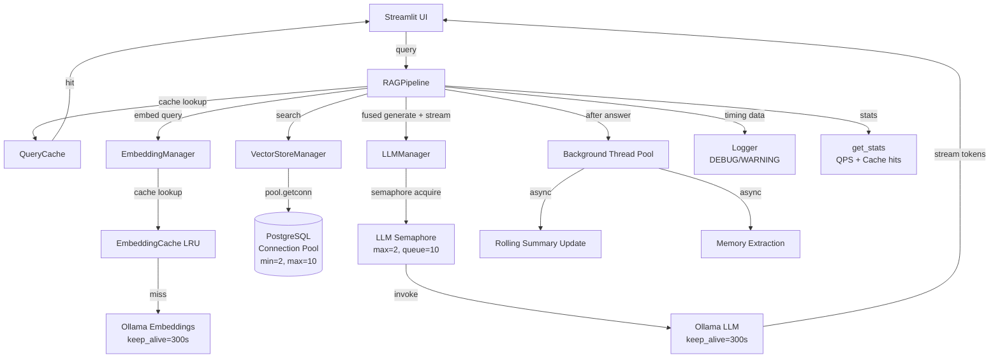
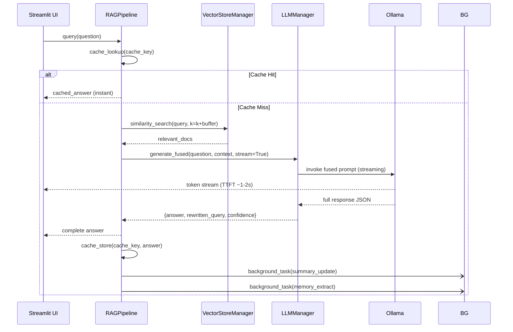

# Design Document: RAG Response Speed Optimization

## Tổng quan (Overview)

Hệ thống RAG chatbot hiện tại sử dụng Ollama local (LLM: qwen2.5:7b, Embedding: nomic-embed-text:v1.5), PostgreSQL + pgvector (hybrid search), và Streamlit. Người dùng phản ánh tốc độ phản hồi "cảm giác rất chậm". Phân tích codebase xác định 6 nguyên nhân gốc rễ chính:

1. **Model unload/reload liên tục** — `keep_alive=0` khiến Ollama giải phóng model khỏi VRAM sau mỗi lần gọi.
2. **Nhiều LLM calls tuần tự** — Query Rewrite (LLM call #1) + Generation (LLM call #2) trong critical path.
3. **Không có connection pooling** — Mỗi query PostgreSQL tạo mới một kết nối TCP.
4. **Fetch 50 candidates không cần thiết** — MMR bị disabled nhưng SQL vẫn hardcode `LIMIT 50`.
5. **Không có concurrency control** — Nhiều users cùng gọi Ollama gây GPU thrash.
6. **Không có caching** — Các query lặp lại phải tính toán lại từ đầu.

Tính năng này triển khai 8 nhóm tối ưu hóa để giảm **perceived latency** (TTFT) và **actual latency** (E2E), đồng thời duy trì chất lượng câu trả lời và tính ổn định hệ thống.

### Mục tiêu tối ưu

| Tối ưu | Tác động dự kiến |
|--------|-----------------|
| Adaptive Keep-Alive (300s) | Loại bỏ model reload overhead (~2-5s/query) |
| Token Streaming | Giảm TTFT từ ~10s xuống ~1-2s (perceived) |
| Async Post-Processing | Loại bỏ ~2-4s blocking sau generation |
| Connection Pooling | Giảm ~50-200ms overhead TCP/auth per query |
| LIMIT k Search | Giảm I/O DB không cần thiết |
| Prompt Fusion | Giảm 1 LLM call (~3-8s) trong critical path |
| LLM Semaphore | Ổn định latency khi nhiều users đồng thời |
| Basic Caching | ~0ms cho repeated queries |

---

## Kiến trúc (Architecture)

### Luồng xử lý hiện tại (Before)

```
User Query
  → [LLM Call #1: Query Rewrite] (~3-8s)
  → [DB: New TCP Connection] (~50-200ms)
  → [DB: Hybrid Search LIMIT 50] (~100-500ms)
  → [LLM Call #2: Generation] (~5-15s)
  → [Blocking: Update Rolling Summary] (~3-8s)
  → [Blocking: Extract User Memories] (~3-8s)
  → Display full response
```

**Tổng E2E: ~17-47s**

### Luồng xử lý sau tối ưu (After)

```
User Query
  → [Cache Lookup] (~1ms) ──hit──→ Return cached answer
  │
  └──miss──→ [DB: Pool Connection] (~1-5ms)
              → [DB: Hybrid Search LIMIT k+buffer] (~50-200ms)
              → [LLM Call #1 (Fused): Rewrite + Generation, Streaming] (~5-15s, TTFT ~1-2s)
              → Display first token (TTFT)
              → Stream remaining tokens
              → Return answer to user
              → [Background: Update Rolling Summary] (non-blocking)
              → [Background: Extract User Memories] (non-blocking)
```

**TTFT: ~1-2s | E2E: ~6-20s**

### Sơ đồ kiến trúc tổng thể



### Sơ đồ luồng Prompt Fusion



---

## Components và Interfaces

### 1. PerformanceBenchmark (mới)

Module đo lường hiệu năng, được inject vào `RAGPipeline`.

```python
class PerformanceBenchmark:
    """Đo lường thời gian từng bước pipeline và theo dõi QPS."""
    
    def __init__(self, window_seconds: int = 60):
        self._query_timestamps: deque[float]  # rolling window
        self._window_seconds = window_seconds
    
    @contextmanager
    def measure(self, step_name: str) -> Generator[None, None, None]:
        """Context manager đo thời gian một bước, log WARNING nếu > 5000ms."""
        ...
    
    def record_query(self) -> None:
        """Ghi nhận một query mới vào rolling window."""
        ...
    
    def get_qps(self) -> float:
        """Trả về số queries/giây trong rolling window 60s."""
        ...
    
    def build_timing_dict(self, timings: dict[str, float]) -> dict[str, Any]:
        """Tạo timing breakdown dict để trả về trong response."""
        ...
```

**Timing keys chuẩn:**
- `embedding_ms`: thời gian embed query
- `search_ms`: thời gian hybrid search
- `llm_ms`: thời gian LLM generation
- `queue_wait_ms`: thời gian chờ LLM semaphore
- `ttft_ms`: Time To First Token
- `total_ms`: tổng E2E

### 2. LLMManager (cập nhật)

```python
class LLMManager:
    def __init__(
        self,
        model: str = LLM_MODEL,
        base_url: str = OLLAMA_BASE_URL,
        temperature: float = LLM_TEMPERATURE,
        keep_alive: int = OLLAMA_KEEP_ALIVE,          # mới: mặc định 300
        max_concurrent_calls: int = LLM_MAX_CONCURRENT_CALLS,  # mới: mặc định 2
        max_queue_size: int = LLM_MAX_QUEUE_SIZE,     # mới: mặc định 10
    ):
        self._semaphore: threading.Semaphore
        self._queue_lock: threading.Lock
        self._active_count: int
        self._queue_count: int
    
    def invoke(self, prompt: str) -> str:
        """Gọi LLM với semaphore control, đo queue_wait_time."""
        ...
    
    def stream(self, prompt: str) -> Generator[str, None, None]:
        """Stream tokens từ LLM với semaphore control."""
        ...
    
    def generate_response_fused(
        self,
        query: str,
        context: str,
        system_prompt: Optional[str] = None,
        chat_history: Optional[List[Dict]] = None,
        stream: bool = True,
    ) -> dict[str, Any]:
        """Fused generation: rewrite + answer trong 1 LLM call.
        
        Returns: {"answer": str, "rewritten_query": Optional[str], "confidence": Optional[float]}
        """
        ...
    
    def generate_response(
        self,
        query: str,
        context: str,
        system_prompt: Optional[str] = None,
        chat_history: Optional[List[Dict]] = None,
    ) -> str:
        """Non-fused generation (backward compat)."""
        ...
```

**Semaphore logic:**
- `threading.Semaphore(max_concurrent_calls)` — giới hạn concurrent calls
- Queue tracking bằng counter + lock
- Nếu `queue_count >= max_queue_size`: raise `LLMQueueFullError` ngay lập tức
- Timeout 120s khi chờ semaphore

### 3. EmbeddingManager (cập nhật)

```python
class EmbeddingManager:
    def __init__(
        self,
        model: str = EMBEDDING_MODEL,
        base_url: str = OLLAMA_BASE_URL,
        batch_size: int = EMBEDDING_BATCH_SIZE,
        keep_alive: int = OLLAMA_KEEP_ALIVE,           # mới: mặc định 300
        cache_enabled: bool = EMBEDDING_CACHE_ENABLED, # mới
        cache_max_size: int = EMBEDDING_CACHE_MAX_SIZE, # mới: mặc định 1000
    ):
        self._cache: Optional[LRUCache]  # None nếu cache_enabled=False
    
    def embed_query(self, text: str) -> List[float]:
        """Embed với LRU cache lookup trước."""
        ...
    
    def _normalize_text(self, text: str) -> str:
        """lowercase → strip → collapse whitespace."""
        ...
    
    def _cache_key(self, normalized_text: str) -> str:
        """SHA256 hash của normalized text."""
        ...
```

**LRU Cache implementation:**
- Dùng `functools.lru_cache` hoặc `collections.OrderedDict` tự implement
- Key: `SHA256(normalized_text)[:16]`
- Max size: `EMBEDDING_CACHE_MAX_SIZE` (mặc định 1000)
- Thread-safe với `threading.Lock`

### 4. VectorStoreManager (cập nhật)

```python
class VectorStoreManager:
    def __init__(
        self,
        ...,
        pool_min_size: int = POSTGRES_POOL_MIN_SIZE,  # mới: mặc định 2
        pool_max_size: int = POSTGRES_POOL_MAX_SIZE,  # mới: mặc định 10
        search_result_buffer: int = SEARCH_RESULT_BUFFER,  # mới: mặc định 5
    ):
        self._pool: Optional[psycopg.pool.ConnectionPool]  # mới
    
    def _get_pool(self) -> psycopg.pool.ConnectionPool:
        """Lazy-init connection pool."""
        ...
    
    def _postgres_similarity_search(
        self,
        query: str,
        k: int = 4,
        filter: Optional[Dict] = None,
        keyword_query: Optional[str] = None,
        mmr_enabled: bool = False,
        mmr_fetch_k: int = 30,
    ) -> List[Document]:
        """Hybrid search với dynamic LIMIT và connection pool."""
        # fetch_limit = k + buffer nếu MMR disabled
        # fetch_limit = mmr_fetch_k nếu MMR enabled
        ...
```

**Connection Pool:**
- Dùng `psycopg.pool.ConnectionPool` (sync, psycopg3)
- `min_size=POSTGRES_POOL_MIN_SIZE`, `max_size=POSTGRES_POOL_MAX_SIZE`
- `timeout=30` giây khi chờ connection
- Auto-reconnect khi connection stale

**Dynamic LIMIT:**
```python
if mmr_enabled:
    fetch_limit = mmr_fetch_k
else:
    fetch_limit = k + search_result_buffer
```

### 5. QueryCache (mới)

```python
class QueryCache:
    """In-memory query cache với TTL."""
    
    def __init__(
        self,
        ttl_seconds: int = CACHE_TTL_SECONDS,
        enabled: bool = QUERY_CACHE_ENABLED,
    ):
        self._store: dict[str, tuple[Any, float]]  # key → (value, expire_at)
        self._lock: threading.Lock
        self._hits: int = 0
        self._misses: int = 0
    
    def make_key(
        self,
        query: str,
        top_k: int,
        filters: Optional[dict],
        model_version: str,
    ) -> str:
        """Tạo cache key: hash(normalized_query + str(top_k) + str(sorted_filters) + model_version)."""
        ...
    
    def get(self, key: str) -> Optional[Any]:
        """Lookup cache, trả về None nếu miss hoặc expired."""
        ...
    
    def set(self, key: str, value: Any) -> None:
        """Lưu vào cache với TTL."""
        ...
    
    def get_stats(self) -> dict[str, int]:
        """Trả về {"hits": N, "misses": N}."""
        ...
    
    @staticmethod
    def normalize_text(text: str) -> str:
        """lowercase → strip → collapse whitespace."""
        ...
```

### 6. PostResponseTaskExecutor (mới)

```python
class PostResponseTaskExecutor:
    """Chạy background tasks sau khi trả lời user."""
    
    def __init__(self, timeout_seconds: int = 60):
        self._executor: ThreadPoolExecutor
        self._timeout = timeout_seconds
    
    def submit(
        self,
        fn: Callable,
        *args,
        task_name: str = "background_task",
        **kwargs,
    ) -> None:
        """Submit task vào background thread pool.
        
        - Bắt exception, log ERROR nếu task fail
        - Cancel nếu vượt quá timeout_seconds
        """
        ...
```

### 7. RAGPipeline (cập nhật)

```python
class RAGPipeline:
    def __init__(
        self,
        ...,
        query_cache: Optional[QueryCache] = None,
        benchmark: Optional[PerformanceBenchmark] = None,
        post_task_executor: Optional[PostResponseTaskExecutor] = None,
        prompt_fusion_enabled: bool = PROMPT_FUSION_ENABLED,
        streaming_enabled: bool = STREAMING_ENABLED,
        async_post_processing_enabled: bool = ASYNC_POST_PROCESSING_ENABLED,
    ):
        ...
    
    def query(
        self,
        question: str,
        k: int = 4,
        system_prompt: Optional[str] = None,
        chat_history: Optional[List[Dict]] = None,
    ) -> Dict[str, Any]:
        """Query với đầy đủ tối ưu hóa.
        
        Returns: {
            "answer": str,
            "sources": List[dict],
            "context": str,
            "rewritten_query": Optional[str],
            "timing": {
                "embedding_ms": float,
                "search_ms": float,
                "llm_ms": float,
                "queue_wait_ms": float,
                "ttft_ms": float,
                "total_ms": float,
            }
        }
        """
        ...
    
    def query_stream(
        self,
        question: str,
        k: int = 4,
        system_prompt: Optional[str] = None,
        chat_history: Optional[List[Dict]] = None,
    ) -> Generator[str, None, None]:
        """Streaming query — yield từng token."""
        ...
    
    def warmup(self) -> None:
        """Warm-up LLM vào VRAM. Log WARNING nếu fail, không crash."""
        ...
```

---

## Data Models

### TimingBreakdown

```python
@dataclass
class TimingBreakdown:
    embedding_ms: float = 0.0
    search_ms: float = 0.0
    llm_ms: float = 0.0
    queue_wait_ms: float = 0.0
    ttft_ms: float = 0.0
    total_ms: float = 0.0
    
    def to_dict(self) -> dict[str, float]:
        return dataclasses.asdict(self)
```

### FusedLLMResponse

```python
@dataclass
class FusedLLMResponse:
    answer: str
    rewritten_query: Optional[str] = None
    confidence: Optional[float] = None
    
    @classmethod
    def from_json(cls, raw: str) -> "FusedLLMResponse":
        """Parse JSON từ LLM output. Fallback về raw text nếu parse fail."""
        ...
    
    @classmethod
    def from_raw_text(cls, text: str) -> "FusedLLMResponse":
        """Fallback: treat toàn bộ text là answer."""
        return cls(answer=text)
```

### CacheEntry

```python
@dataclass
class CacheEntry:
    value: Any
    expire_at: float  # Unix timestamp
    
    def is_expired(self) -> bool:
        return time.time() > self.expire_at
```

### Environment Variables mới (settings.py)

| Variable | Default | Mô tả |
|----------|---------|-------|
| `OLLAMA_KEEP_ALIVE` | `300` | Giây giữ model trong VRAM |
| `OLLAMA_MAX_LOADED_MODELS` | `1` | Số model tối đa load vào VRAM |
| `STREAMING_ENABLED` | `true` | Bật/tắt token streaming |
| `ASYNC_POST_PROCESSING_ENABLED` | `true` | Bật/tắt async post-processing |
| `POSTGRES_POOL_MIN_SIZE` | `2` | Min connections trong pool |
| `POSTGRES_POOL_MAX_SIZE` | `10` | Max connections trong pool |
| `PROMPT_FUSION_ENABLED` | `true` | Bật/tắt Prompt Fusion |
| `LLM_MAX_CONCURRENT_CALLS` | `2` | Max concurrent LLM calls |
| `LLM_MAX_QUEUE_SIZE` | `10` | Max queue size cho LLM semaphore |
| `QUERY_CACHE_ENABLED` | `true` | Bật/tắt Query Cache |
| `EMBEDDING_CACHE_ENABLED` | `true` | Bật/tắt Embedding Cache |
| `CACHE_TTL_SECONDS` | `300` | TTL cho Query Cache |
| `EMBEDDING_CACHE_MAX_SIZE` | `1000` | Max entries trong Embedding Cache |
| `SEARCH_RESULT_BUFFER` | `5` | Buffer candidates ngoài k |


---

## Correctness Properties

*A property là một đặc tính hoặc hành vi phải đúng trong mọi lần thực thi hợp lệ của hệ thống — về cơ bản là một phát biểu hình thức về những gì hệ thống phải làm. Properties đóng vai trò là cầu nối giữa đặc tả dạng ngôn ngữ tự nhiên và các đảm bảo tính đúng đắn có thể kiểm chứng tự động.*

### Property 1: Timing dict luôn đầy đủ

*Với bất kỳ* query hợp lệ nào được xử lý bởi RAGPipeline, response dict phải luôn chứa key `"timing"` với tất cả các keys bắt buộc (`embedding_ms`, `search_ms`, `llm_ms`, `queue_wait_ms`, `total_ms`) và tất cả giá trị phải là số không âm.

**Validates: Requirements 1.1, 1.2, 1.7, 1.8**

---

### Property 2: TTFT luôn nhỏ hơn hoặc bằng E2E Latency

*Với bất kỳ* query nào, `timing["ttft_ms"]` phải luôn có mặt trong timing dict và phải thỏa mãn `ttft_ms <= total_ms`.

**Validates: Requirements 1.3**

---

### Property 3: QPS counter phản ánh đúng số queries trong rolling window

*Với bất kỳ* số lượng N queries được submit trong khoảng thời gian T giây (T <= 60), `get_stats()["qps"]` phải phản ánh đúng số queries trong rolling window 60 giây.

**Validates: Requirements 1.6**

---

### Property 4: Keep-alive env var override

*Với bất kỳ* giá trị integer hợp lệ nào được set cho `OLLAMA_KEEP_ALIVE`, cả `LLMManager` và `EmbeddingManager` đều phải sử dụng giá trị đó thay vì giá trị mặc định 300.

**Validates: Requirements 2.3, 2.4**

---

### Property 5: Response được trả về trước khi background tasks hoàn thành

*Với bất kỳ* query nào khi `ASYNC_POST_PROCESSING_ENABLED=true`, RAGPipeline phải trả về câu trả lời cho user trước khi rolling summary update và memory extraction hoàn thành (ngay cả khi các background tasks có delay).

**Validates: Requirements 3.1, 3.2, 3.6**

---

### Property 6: Dynamic LIMIT trong hybrid search

*Với bất kỳ* giá trị `k` hợp lệ nào (k >= 1) khi MMR bị disabled, số lượng candidates fetch từ database phải bằng `k + SEARCH_RESULT_BUFFER` (không phải hardcode 50). Khi MMR enabled, fetch limit phải bằng `mmr_fetch_k`.

**Validates: Requirements 6.1, 6.2, 6.3, 6.4, 6.8**

---

### Property 7: Metadata filter pre-filters kết quả

*Với bất kỳ* metadata filter dict nào được truyền vào `similarity_search`, tất cả documents được trả về phải có metadata khớp với filter đó.

**Validates: Requirements 6.6**

---

### Property 8: Prompt Fusion giảm xuống còn 1 LLM call

*Với bất kỳ* query nào khi `PROMPT_FUSION_ENABLED=true`, LLM phải được gọi đúng 1 lần trong critical path (không phải 2 lần như flow rewrite + generate riêng biệt).

**Validates: Requirements 7.1, 7.2**

---

### Property 9: Fused response parsing xử lý đúng mọi JSON hợp lệ

*Với bất kỳ* JSON string hợp lệ theo `Fused_Response_Format` (có hoặc không có field `confidence`), `FusedLLMResponse.from_json()` phải trích xuất đúng `answer` và `rewritten_query`, và `confidence` phải là `None` nếu không có trong JSON.

**Validates: Requirements 7.8, 7.10**

---

### Property 10: Response dict luôn có rewritten_query khi Prompt Fusion enabled

*Với bất kỳ* query nào khi `PROMPT_FUSION_ENABLED=true`, response dict phải luôn chứa key `"rewritten_query"` (giá trị có thể là `null`).

**Validates: Requirements 7.6**

---

### Property 11: Semaphore luôn được release sau mỗi LLM call

*Với bất kỳ* LLM call nào (thành công hoặc raise exception), số lượng semaphore slots khả dụng phải được khôi phục về giá trị trước khi call sau khi call hoàn thành.

**Validates: Requirements 8.6**

---

### Property 12: Semaphore queue theo thứ tự FIFO

*Với bất kỳ* chuỗi requests nào bị queue do semaphore đầy, các requests phải được xử lý theo thứ tự FIFO (request đến trước được xử lý trước).

**Validates: Requirements 8.7**

---

### Property 13: Query cache hit tránh gọi LLM

*Với bất kỳ* query nào đã được cache và chưa hết TTL, lần gọi tiếp theo với cùng query đó phải trả về cached answer mà không gọi LLM hay database.

**Validates: Requirements 9.1, 9.2**

---

### Property 14: Embedding cache hit tránh gọi Ollama

*Với bất kỳ* text nào đã được embed và lưu trong cache, lần gọi `embed_query` tiếp theo với cùng text đó phải trả về cached vector mà không gọi Ollama.

**Validates: Requirements 9.3, 9.4**

---

### Property 15: Cache stats phản ánh đúng hits và misses

*Với bất kỳ* chuỗi cache lookups nào (hits và misses), `get_stats()["cache_hits"]` và `get_stats()["cache_misses"]` phải phản ánh chính xác số lần hit và miss tương ứng.

**Validates: Requirements 9.8**

---

### Property 16: Text normalization đảm bảo cache key nhất quán

*Với bất kỳ* hai queries chỉ khác nhau về whitespace hoặc chữ hoa/thường, chúng phải tạo ra cùng một cache key và trả về cùng một cached answer (nếu đã cache).

**Validates: Requirements 9.9, 9.10**

---

### Property 17: Connection pool size tuân theo env var configuration

*Với bất kỳ* giá trị hợp lệ nào được set cho `POSTGRES_POOL_MIN_SIZE` và `POSTGRES_POOL_MAX_SIZE`, connection pool phải được khởi tạo với đúng các giá trị đó.

**Validates: Requirements 5.4, 5.5**

---

## Error Handling

### Chiến lược xử lý lỗi theo từng component

#### LLMManager

| Lỗi | Hành vi |
|-----|---------|
| Ollama không khả dụng khi warm-up | Log WARNING, tiếp tục khởi động bình thường |
| Streaming connection bị ngắt | Log ERROR, trả về phần response đã nhận |
| Semaphore timeout (>120s) | Raise `LLMTimeoutError` với thời gian chờ thực tế |
| Queue đầy | Raise `LLMQueueFullError` ngay lập tức |
| `LLM_MAX_CONCURRENT_CALLS < 1` | Log WARNING, dùng default 2 |
| Fused response JSON parse fail | Log WARNING, fallback về raw text |

#### EmbeddingManager

| Lỗi | Hành vi |
|-----|---------|
| Ollama embedding fail | Retry với exponential backoff (2s, 4s), raise sau 3 lần |
| Text quá dài (>8000 chars) | Truncate trước khi embed |

#### VectorStoreManager

| Lỗi | Hành vi |
|-----|---------|
| Pool connection timeout (>30s) | Raise `PoolTimeoutError` |
| Stale/broken connection | Auto-reconnect bởi psycopg pool |
| `k < 1` | Raise `ValueError` với message mô tả rõ ràng |
| Invalid env var (e.g., `POSTGRES_POOL_MAX_SIZE=abc`) | Log WARNING, dùng default |

#### PostResponseTaskExecutor

| Lỗi | Hành vi |
|-----|---------|
| Background task raise exception | Log ERROR, không crash main thread |
| Background task timeout (>60s) | Cancel task, log WARNING |

#### QueryCache

| Lỗi | Hành vi |
|-----|---------|
| Cache entry expired | Xóa entry, xử lý query từ đầu |
| Invalid env var cho TTL | Log WARNING, dùng default 300s |

### Custom Exceptions

```python
class LLMTimeoutError(Exception):
    """Raised khi LLM call chờ semaphore quá 120 giây."""
    pass

class LLMQueueFullError(Exception):
    """Raised khi LLM semaphore queue đã đầy."""
    pass

class PoolTimeoutError(Exception):
    """Raised khi không lấy được connection từ pool trong 30 giây."""
    pass
```

---

## Testing Strategy

### Dual Testing Approach

Tính năng này sử dụng kết hợp **unit tests** và **property-based tests** để đảm bảo coverage toàn diện.

- **Unit tests**: Kiểm tra các ví dụ cụ thể, edge cases, error conditions, và integration points
- **Property tests**: Kiểm tra các universal properties trên nhiều inputs ngẫu nhiên

### Property-Based Testing

**Library**: [Hypothesis](https://hypothesis.readthedocs.io/) (Python)

**Cấu hình**: Mỗi property test chạy tối thiểu 100 iterations.

**Tag format**: `# Feature: rag-response-speed-optimization, Property {N}: {property_text}`

#### Property Tests cần implement

| Property | Test | Hypothesis Strategy |
|----------|------|---------------------|
| P1: Timing dict completeness | `test_timing_dict_always_complete` | `st.text()` cho query |
| P2: TTFT <= E2E | `test_ttft_leq_total_ms` | `st.text()` cho query |
| P3: QPS counter accuracy | `test_qps_counter_accuracy` | `st.integers(1, 100)` cho N queries |
| P4: Keep-alive env var override | `test_keep_alive_env_override` | `st.integers(0, 3600)` cho keep_alive value |
| P5: Non-blocking response | `test_response_before_background_tasks` | `st.integers(1, 10)` cho task delay |
| P6: Dynamic LIMIT | `test_dynamic_limit_no_mmr` | `st.integers(1, 20)` cho k |
| P7: Metadata filter | `test_metadata_filter_results` | `st.dictionaries(st.text(), st.text())` |
| P8: Single LLM call with fusion | `test_prompt_fusion_single_llm_call` | `st.text()` cho query |
| P9: Fused response parsing | `test_fused_response_parsing` | `st.fixed_dictionaries(...)` |
| P10: rewritten_query in response | `test_rewritten_query_in_response` | `st.text()` cho query |
| P11: Semaphore always released | `test_semaphore_always_released` | `st.booleans()` cho success/fail |
| P12: FIFO queue order | `test_semaphore_fifo_order` | `st.lists(st.integers())` cho request sequence |
| P13: Query cache hit | `test_query_cache_hit_avoids_llm` | `st.text()` cho query |
| P14: Embedding cache hit | `test_embedding_cache_hit_avoids_ollama` | `st.text()` cho text |
| P15: Cache stats accuracy | `test_cache_stats_accuracy` | `st.lists(st.text())` cho query sequence |
| P16: Text normalization cache key | `test_normalization_same_cache_key` | `st.text()` + whitespace/case variants |
| P17: Pool size env var | `test_pool_size_env_var` | `st.integers(1, 5)`, `st.integers(5, 20)` |

#### Ví dụ Property Test

```python
from hypothesis import given, settings
import hypothesis.strategies as st

# Feature: rag-response-speed-optimization, Property 1: Timing dict always complete
@given(query=st.text(min_size=1, max_size=200))
@settings(max_examples=100)
def test_timing_dict_always_complete(query, mock_rag_pipeline):
    """For any valid query, response must contain complete timing dict."""
    result = mock_rag_pipeline.query(query)
    assert "timing" in result
    timing = result["timing"]
    required_keys = {"embedding_ms", "search_ms", "llm_ms", "queue_wait_ms", "total_ms"}
    assert required_keys.issubset(timing.keys())
    assert all(v >= 0 for v in timing.values())

# Feature: rag-response-speed-optimization, Property 16: Text normalization cache key
@given(
    base_text=st.text(min_size=1, max_size=100, alphabet=st.characters(whitelist_categories=("Lu", "Ll", "Nd"))),
    extra_spaces=st.integers(1, 5),
)
@settings(max_examples=100)
def test_normalization_same_cache_key(base_text, extra_spaces, query_cache):
    """Queries differing only in whitespace/case should produce same cache key."""
    query1 = base_text.lower()
    query2 = " " * extra_spaces + base_text.upper() + " " * extra_spaces
    key1 = query_cache.make_key(query1, top_k=4, filters=None, model_version="v1")
    key2 = query_cache.make_key(query2, top_k=4, filters=None, model_version="v1")
    assert key1 == key2
```

### Unit Tests

#### Các test cases quan trọng

**LLMManager:**
- Default `keep_alive=300` khi không có env var
- Semaphore reject khi queue đầy
- Semaphore timeout sau 120s
- Fused response JSON parse thành công
- Fused response fallback khi JSON invalid
- Streaming trả về generator

**EmbeddingManager:**
- Default `keep_alive=300`
- LRU cache eviction khi đạt max size
- Cache disabled khi `EMBEDDING_CACHE_ENABLED=false`

**VectorStoreManager:**
- Connection pool khởi tạo với đúng min/max size
- `k < 1` raise ValueError
- Dynamic LIMIT với MMR disabled
- Dynamic LIMIT với MMR enabled

**QueryCache:**
- TTL expiry xóa entry
- Cache disabled khi `QUERY_CACHE_ENABLED=false`
- Stats tracking chính xác

**PostResponseTaskExecutor:**
- Exception trong background task không crash main thread
- Task timeout sau 60s bị cancel

**RAGPipeline:**
- Warm-up fail không crash pipeline
- Prompt Fusion disabled dùng 2 LLM calls
- Cache hit trả về ngay không gọi LLM

### Integration Tests

- End-to-end query với PostgreSQL thực (test environment)
- Connection pool reuse verification
- Streaming tokens đến Streamlit UI
- Background tasks hoàn thành sau khi response trả về

### Test Structure

```
tests/
├── unit/
│   ├── test_llm_manager.py          # LLMManager unit tests
│   ├── test_embedding_manager.py    # EmbeddingManager unit tests
│   ├── test_vector_store_manager.py # VectorStoreManager unit tests
│   ├── test_query_cache.py          # QueryCache unit tests
│   ├── test_post_response_executor.py
│   └── test_rag_pipeline.py         # RAGPipeline unit tests
├── property/
│   ├── test_timing_properties.py    # Properties 1-3
│   ├── test_config_properties.py    # Properties 4, 17
│   ├── test_async_properties.py     # Property 5
│   ├── test_search_properties.py    # Properties 6-7
│   ├── test_fusion_properties.py    # Properties 8-10
│   ├── test_semaphore_properties.py # Properties 11-12
│   └── test_cache_properties.py     # Properties 13-16
└── integration/
    ├── test_connection_pool.py
    ├── test_streaming.py
    └── test_e2e_pipeline.py
```
