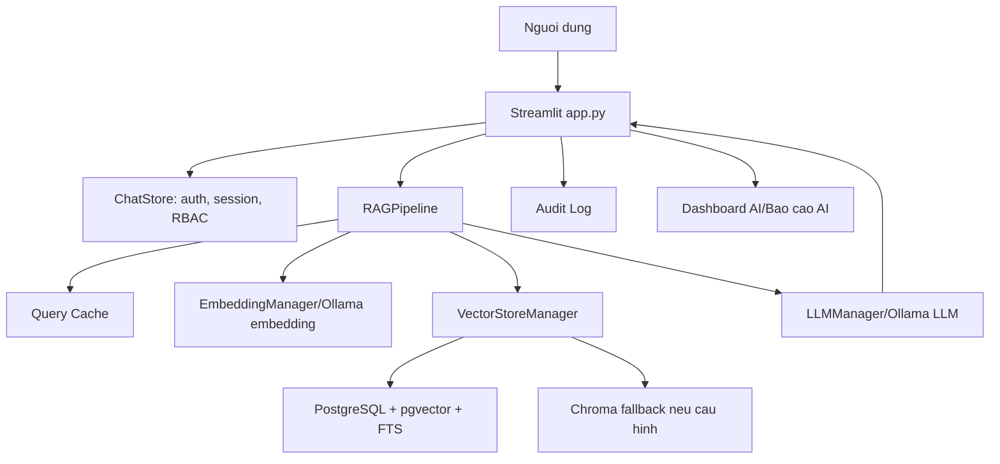
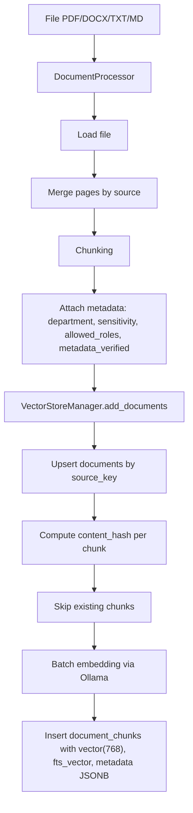
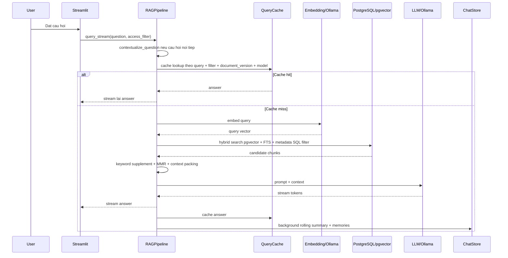
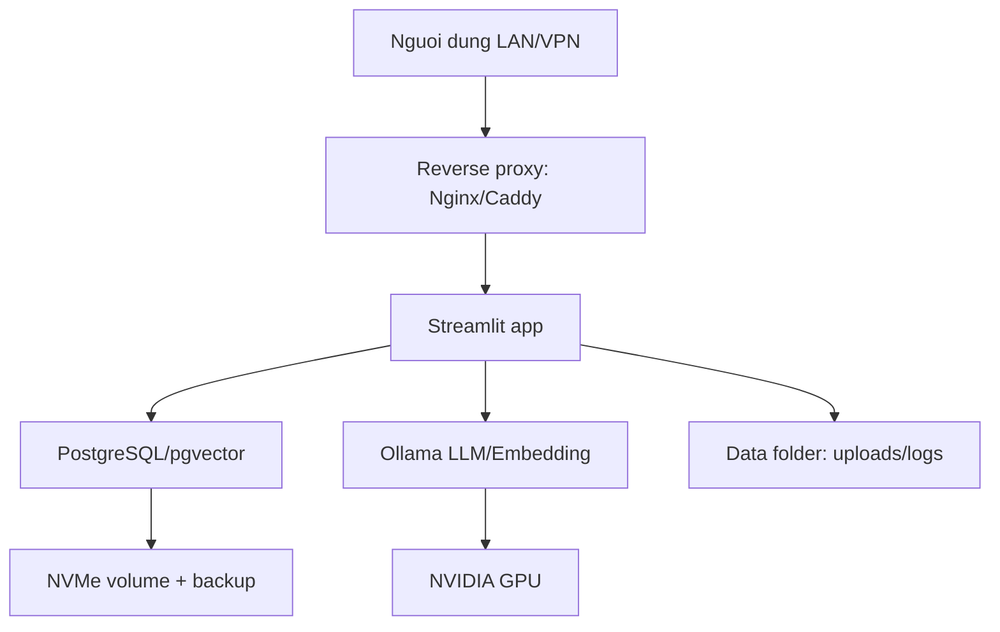

# SecureDocs AI / Local AI RAG - Tai lieu doc hieu he thong

Tai lieu nay giai thich toan bo du an theo goc nhin ky thuat: he thong dang lam gi, luong RAG xu ly nhu the nao, su dung thuat toan nao, vi sao co latency cao, vi sao co hallucination, va neu dua len mot may desktop manh de host local cho khoang 50 nguoi thi can thiet ke van hanh ra sao.

Tai lieu bam theo nhanh hien tai `feat/document-registration`.

## 1. Tom tat ngan gon

Du an la mot he thong hoi dap tai lieu noi bo chay local. Nguoi dung upload tai lieu, he thong tach tai lieu thanh cac chunk, tao embedding bang Ollama, luu metadata va vector vao PostgreSQL/pgvector, sau do khi nguoi dung dat cau hoi thi he thong truy xuat cac chunk lien quan, loc theo quyen truy cap, dua context vao LLM Ollama va tra loi kem nguon trich dan.

Thanh phan chinh:

| Thanh phan | Vai tro |
|---|---|
| Streamlit `app.py` | Giao dien web: dang nhap, chat, upload, Document Library, Document Details, Audit Log, RBAC Admin, Dashboard AI, Bao cao AI |
| Ollama | Chay LLM local va embedding model local |
| PostgreSQL + pgvector | Luu users, documents, chunks, embeddings, audit logs, memories, RBAC |
| RAG Pipeline | Dieu phoi query cache, contextual rewrite, retrieval, rerank, prompt, streaming, post-processing |
| RBAC/metadata filter | Dam bao nguoi dung chi thay context trong pham vi quyen |
| Query cache/embedding cache | Giam latency cho cau hoi lap lai va embedding lap lai |

Ket luan quan trong:

- Luong chinh nen dung `VECTOR_STORE_BACKEND=postgres`.
- Chroma van con trong code nhu backend du phong/legacy. Neu `.env` co `VECTOR_STORE_BACKEND=postgres` thi app dung PostgreSQL/pgvector.
- Default trong code hien tai van la `"chroma"` neu thieu `.env`; neu production chi dung PostgreSQL thi nen doi default thanh `"postgres"`.

## 2. Cau truc thu muc quan trong

| Duong dan | Noi dung |
|---|---|
| `app.py` | Streamlit app, dieu huong UI, chat, upload, dashboard, audit, RBAC admin |
| `src/config/settings.py` | Cau hinh model, backend vector, chunking, cache, queue, PostgreSQL pool |
| `src/rag/rag_pipeline.py` | RAG orchestration: cache, rewrite, retrieval, context packing, generation |
| `src/rag/vector_store.py` | PostgreSQL/pgvector, Chroma fallback, hybrid search, RRF, MMR, document registration |
| `src/llm/llm_manager.py` | Ollama LLM, semaphore, queue, streaming, runtime status |
| `src/embeddings/embedding_manager.py` | Ollama embeddings, batch embedding, LRU embedding cache |
| `src/document_loader/loader.py` | Load PDF/DOCX/TXT/MD, merge pages, chunking |
| `src/security/access_policy.py` | RBAC policy, department/sensitivity filter, Chroma compact filter |
| `src/storage/chat_store.py` | Auth, users, sessions, chat messages, audit logs, user memories, RBAC admin storage |
| `src/admin_analytics.py` | Dashboard/Bao cao AI, export Excel/PDF |
| `src/admin_rbac.py` | UI quan tri RBAC, force logout, user/group admin |
| `database/postgres/schema.sql` | Schema PostgreSQL/pgvector |
| `docker-compose.yml` | PostgreSQL pgvector container |

## 3. Luong tong the cua he thong



He thong co hai luong lon:

1. Ingestion: dua tai lieu vao kho tri thuc.
2. Query: hoi dap RAG tren kho tai lieu da duoc phan quyen.

## 4. Luong ingestion tai lieu

Khi upload hoac load tai lieu, luong xu ly chinh nhu sau:



### 4.1 File types

`DocumentProcessor` ho tro:

- `.pdf` bang `PyPDFLoader`
- `.docx` bang `UnstructuredWordDocumentLoader`
- `.txt`, `.md` bang `TextLoader`

Chua thay luong native cho `.xlsx`. Neu can Excel, nen chuyen sang PDF/TXT/MD truoc khi ingest hoac bo sung loader rieng.

### 4.2 Chunking

Cau hinh trong `settings.py`:

```env
CHUNK_SIZE=1000
CHUNK_OVERLAP=200
CHUNK_STRATEGY=recursive
MAX_CHUNK_SIZE=1500
MIN_CHUNK_SIZE=200
CONTEXT_DEPTH=3
```

He thong co 2 huong chunking:

- Recursive chunking: phu hop tai lieu hoc thuat, bao cao, van ban khong theo cau truc phap ly ro rang.
- Adaptive chunking: co huong nhan dien cau truc van ban phap ly/tai lieu co heading, chuong, dieu.

Chunking anh huong rat lon toi chat luong RAG:

- Chunk qua dai: retrieval kem chinh xac, context bi loang, LLM de bo sot.
- Chunk qua ngan: mat ngu canh, cau tra loi bi dut doan.
- Overlap qua cao: tang so chunk, tang dung luong DB, tang latency ingestion/retrieval.
- Overlap qua thap: mat thong tin giua ranh gioi chunk.

### 4.3 Metadata va phan quyen

Moi tai lieu/chunk nen co metadata:

| Metadata | Y nghia |
|---|---|
| `department` | Phong ban so huu hoac pham vi tai lieu |
| `sensitivity` | `public`, `internal`, `confidential`, `restricted` |
| `allowed_roles` | Role duoc phep xem |
| `metadata_verified` | Xac nhan metadata da duoc gan dung |
| `file_name`, `file_path` | Hien thi nguon/citation |
| `page_number`, `chunk_index` | Truy vet chunk |

Neu metadata sai, RAG co the:

- Khong tim thay tai lieu ma nguoi dung duoc phep xem.
- Dua nham tai lieu vao context.
- Chan qua nhieu context va tra loi "khong tim thay".
- Ro ri context neu filter bi thieu.

### 4.4 source_key va content_hash

Trong `vector_store.py`:

- `source_key`: dinh danh nguon tai lieu. Tao tu `file_path`, `source`, `document_id`, `title` hoac fallback text. Dung de upsert vao bang `documents`.
- `content_hash`: SHA256 cua noi dung chunk. Dung de chong trung lap chunk trong cung document.

Loi can tranh:

- Dung ten file khong on dinh lam `source_key` neu file bi doi ten lien tuc.
- Dedup toan cuc qua manh co the lam mat chunk khi 2 tai lieu khac nhau co noi dung giong nhau. Code hien tai da loc `content_hash` theo `document_id`, hop ly hon.

## 5. Co so du lieu

Backend chinh nen la PostgreSQL/pgvector.

Bang quan trong:

| Bang | Vai tro |
|---|---|
| `departments` | Danh muc phong ban |
| `users` | Tai khoan, role, department, clearance, session_version |
| `documents` | Tai lieu goc, source_key, metadata, embedding_status |
| `document_chunks` | Chunk text, embedding vector(768), fts_vector, metadata |
| `chat_sessions` | Phien hoi thoai va rolling summary |
| `chat_messages` | Tin nhan, citations, metadata |
| `audit_logs` | Log dang nhap, upload, query, denied, export, force logout |
| `user_memories` | Bo nho dai han theo user |
| `permission_groups` | Nhom quyen RBAC nang cao |
| `user_permission_groups` | Gan user vao nhom quyen |
| `group_department_permissions` | Ma tran quyen theo nhom/phong ban/sensitivity |

Index quan trong:

- HNSW index tren `embedding vector_cosine_ops`
- GIN index tren `fts_vector`
- GIN index tren `metadata`
- index tren `content_hash`, `document_id`, `page_number`

## 6. Luong query RAG

Luong query streaming trong `RAGPipeline.query_stream`:



## 7. Retrieval: he thong tim chunk nhu the nao

### 7.1 Semantic search bang pgvector

Moi query duoc embed thanh vector 768 chieu. PostgreSQL tinh khoang cach cosine:

```sql
ORDER BY c.embedding <=> query_vector
```

Y nghia:

- Tot cho cau hoi dien dat tu nhien, dong nghia, hoi theo y.
- Kem hon voi ma so, ten rieng, dieu khoan, tu viet tat, so nam, so hieu van ban.

### 7.2 Full-text search bang PostgreSQL FTS

Bang `document_chunks` co `fts_vector`:

```sql
to_tsvector('simple', content)
```

Query dung `to_tsquery('simple', ...)` va `ts_rank_cd`.

Y nghia:

- Tot cho keyword exact: ten rieng, ma so, nam, cum tu ky thuat.
- Kem hon voi dong nghia va cau hoi dien dat khac.

### 7.3 Hybrid search + RRF

He thong chay 2 nhanh:

1. Semantic search: vector similarity.
2. Keyword search: FTS.

Sau do hop nhat bang RRF:

```text
rrf_score = 1 / (60 + semantic_rank) + 1 / (60 + keyword_rank)
```

Trong code con nhan them `doc_authority` neu metadata co.

Tai sao dung RRF:

- Semantic search co the bo sot exact keyword.
- FTS co the bo sot cau hoi dien dat tu nhien.
- RRF hop nhat rank cua 2 cach tim, on dinh hon viec cong score thang vi score vector va score FTS khac thang do.

### 7.4 MMR rerank

MMR = Maximal Marginal Relevance.

Cong thuc y tuong:

```text
score = lambda * relevance(query, doc)
        - (1 - lambda) * max_similarity(doc, selected_docs)
```

Cau hinh:

```env
MMR_ENABLED=true
MMR_LAMBDA=0.8
MMR_FETCH_K=60
```

Y nghia:

- Chon chunk vua lien quan, vua khong qua trung lap voi chunk da chon.
- Giam tinh trang 5 chunk deu la doan gan nhau trong cung mot trang.
- Tang da dang context cho cau hoi tong hop.

Doi gia:

- MMR can embed/tinh cosine them cho candidate, co the tang latency.
- `MMR_FETCH_K=60` lay nhieu candidate, chat luong tot hon nhung cham hon.

### 7.5 Keyword supplement

Cau hinh:

```env
KEYWORD_SUPPLEMENT_ENABLED=true
KEYWORD_SUPPLEMENT_TOP_K=5
```

Pipeline tao them query keyword tu cau hoi goc, dac biet voi:

- Ten rieng.
- Cum tu viet hoa.
- Nam/thoi gian.
- Heading/outline.
- Cau hoi rong can tong hop.

Muc dich: bo sung chunk exact-match ma vector search co the bo sot.

## 8. Context packing

Sau retrieval, he thong khong dua tat ca chunk vao LLM. No goi `_select_context_documents` va `_build_context`.

Cau hinh:

```env
MAX_CONTEXT_CHARS=18000
DEFAULT_TOP_K=5
BROAD_QUERY_TOP_K=15
```

Pipeline phan loai query:

- Focused: cau hoi fact, top-k nho.
- Broad: cau hoi tong hop/phan tich/so sanh/liet ke, top-k lon hon.

Context duoc chia nhom:

- Direct: chunk tra loi truc tiep.
- Outline: chunk muc luc/heading.
- Background: chunk ly thuyet/nen tang.
- Extra: bo sung khi con ngan sach context.

Neu context qua dai:

- LLM cham hon.
- LLM de bo sot.
- LLM de bi "lost in the middle".
- Chi phi VRAM/RAM va thoi gian sinh tang.

Neu context qua ngan:

- LLM thieu bang chung.
- De tra loi "khong du du lieu".
- De hallucinate neu prompt khong chan chat.

## 9. Prompt va sinh cau tra loi

He thong co 2 mode:

### 9.1 Classic flow

Day la luong mac dinh khi streaming:

1. Build prompt gom system instruction, context, chat history, question.
2. Goi Ollama streaming.
3. Stream token ve UI.
4. Cache answer.
5. Background summary/memory.

Uu diem:

- De stream.
- On dinh voi model nho.
- It yeu cau model tra JSON dung format.

Nhuoc diem:

- Neu can rewrite rieng thi co the ton them LLM call.

### 9.2 Prompt Fusion

Cau hinh:

```env
PROMPT_FUSION_ENABLED=false
```

Y tuong: bat LLM vua rewrite query, vua answer, vua tra JSON trong 1 call.

Ly do dang tat:

- Model nho nhu `qwen2.5:7b` co the tra JSON loi.
- Chat luong co the giam khi bat model lam qua nhieu viec cung luc.
- Neu output JSON sai, can fallback.

## 10. Chat history, contextual rewrite, rolling summary, user memories

He thong co cac thanh phan giup hoi dap noi tiep:

| Co che | Muc dich |
|---|---|
| Chat history | Dua mot so turn gan nhat vao prompt |
| Contextual rewrite | Bien cau "noi dung do thi sao?" thanh cau hoi day du hon |
| Rolling summary | Tom tat hoi thoai dai de khong nhoi qua nhieu history |
| User memories | Luu thong tin hay lap lai/can nho theo user |

Vi sao can:

- Neu nguoi dung hoi "muc nay", "cai do", "o tren", LLM/retrieval khong biet dang noi den gi.
- Rewrite giup retrieval dung hon.

Rui ro:

- Rewrite sai co the lam retrieval lech.
- Memory sai co the lam answer bi bias.
- Rolling summary qua ngan co the mat y.

## 11. RBAC va bao mat du lieu

He thong co hai lop kiem soat:

### 11.1 Question category permission

`access_policy.py` co tap keyword nhay cam theo phong ban:

- finance: doanh thu, luong, ngan sach...
- security: mat khau, token, api key...
- hr: hop dong lao dong, ky luat, ho so nhan vien...
- legal: kien tung, tranh chap, phap che...

Role:

- Admin: xem tat ca.
- Manager: xem general + phong ban cua minh, den confidential.
- Employee: xem general + phong ban cua minh, den internal.

### 11.2 Metadata filter trong retrieval

Khi query PostgreSQL, filter duoc dua vao SQL truoc khi ranking:

- department
- sensitivity
- allowed_roles
- metadata_verified

Day la diem quan trong: khong phai truy xuat het roi moi loc tren Python. Loc som trong SQL giup:

- Giam nguy co lo context.
- Giam so candidate can rank.
- Tang tinh dung dan cua Audit/RBAC.

### 11.3 RBAC Admin moi

Nhanh `feat/document-registration` bo sung:

- `permission_groups`
- `user_permission_groups`
- `group_department_permissions`
- `clearance_level`
- `session_version`
- `last_login_at`
- force logout
- reset password
- activate/deactivate account

Y nghia van hanh:

- Admin co the thay doi quyen va bat user dang nhap lai.
- Neu tai khoan bi vo hieu hoa, session cu bi invalidate.
- Audit Log ghi lai cac thay doi quan trong.

## 12. Cache

### 12.1 Query cache

Cau hinh:

```env
QUERY_CACHE_ENABLED=true
CACHE_TTL_SECONDS=300
```

Cache key gom:

- query goc
- top_k
- access_filter
- document_version
- contextual_query
- model_version

Tai sao can `access_filter` trong key:

- Cung mot cau hoi nhung 2 user khac quyen phai co cau tra loi khac nhau.
- Neu khong co access_filter, co nguy co user quyen thap nhan cau tra loi cache cua user quyen cao.

Tai sao can `document_version`:

- Khi tai lieu thay doi, cache cu phai het hieu luc.

### 12.2 Embedding cache

Cau hinh:

```env
EMBEDDING_CACHE_ENABLED=true
EMBEDDING_CACHE_MAX_SIZE=1000
```

Embedding cache la LRU cache tren text da normalize. Giam latency khi nguoi dung hoi lai cau giong nhau.

### 12.3 Clear cache

UI sidebar co nut clear query cache. Nen dung sau khi:

- Re-index tai lieu.
- Doi metadata/quyen.
- Thay model.
- Sua prompt quan trong.

## 13. Audit Log, Dashboard AI va Bao cao AI

Audit Log ghi:

- login/logout/register
- document_upload
- question_allowed
- access denied
- user_force_logout
- session_invalidated
- RBAC changes
- export CSV/Excel/PDF neu co log

Dashboard/Bao cao AI doc tu audit logs va runtime status:

- Tong so truy van.
- Latency trung binh.
- Nguon tai lieu duoc dung.
- Breakdown theo phong ban/user.
- Queue LLM hien tai.
- Canh bao tai nguyen.
- Export Excel/PDF.

Day la nen tang de giai thich voi nguoi dung/lanh dao vi sao he thong cham, ai dung nhieu, tai lieu nao duoc hoi nhieu.

## 14. Ollama an RAM, VRAM, CPU nhu the nao

Khi chay Ollama:

| Tai nguyen | Bi dung khi nao |
|---|---|
| VRAM GPU | Neu model/offload duoc dua len GPU. Day la tai nguyen quy nhat cho toc do generate. |
| RAM he thong | Luon dung de load model, buffer, OS cache, PostgreSQL, Streamlit, Python. Neu VRAM khong du, model/part model se nam RAM va chay cham. |
| CPU | Dieu phoi, tokenization, xu ly phan model khong offload, PostgreSQL, parsing tai lieu. |
| Disk/NVMe | Luu model, database, WAL, file upload, logs. Anh huong ingestion va DB I/O. |

Lenh kiem tra GPU:

```powershell
nvidia-smi
```

Neu thay `ollama.exe` dung VRAM, model dang chay GPU. Neu khong thay, co the dang CPU/RAM la chinh.

## 15. Vi sao latency lau

Latency cua he thong RAG khong chi nam o LLM. No la tong cua nhieu buoc:

```text
Total latency =
  session/auth/RBAC
+ contextual rewrite
+ query cache lookup
+ query embedding
+ PostgreSQL hybrid retrieval
+ keyword supplement
+ MMR rerank
+ context packing
+ queue wait
+ LLM time-to-first-token
+ LLM generation time
+ save chat/audit
+ background tasks
```

### 15.1 Nguyen nhan tu Ollama/LLM

| Nguyen nhan | Giai thich | Cach giam |
|---|---|---|
| Model qua lon | 14B/32B sinh cham hon 7B | Dung model nho hon, quantization phu hop |
| Khong du VRAM | Model bi offload sang RAM/CPU | GPU VRAM lon hon, giam context/model |
| Model bi unload/reload | Moi request phai load lai model | Tang `OLLAMA_KEEP_ALIVE`, warmup |
| Nhieu request dong thoi | GPU thrash, queue tang | Gioi han `LLM_MAX_CONCURRENT_CALLS`, them worker/GPU |
| Context qua dai | Moi token phai attend tren context lon | Giam `MAX_CONTEXT_CHARS`, top_k, chunk noise |
| Output qua dai | Generate nhieu token ton thoi gian | Gioi han style tra loi, yeu cau ngan gon |

### 15.2 Nguyen nhan tu retrieval

| Nguyen nhan | Giai thich | Cach giam |
|---|---|---|
| `MMR_FETCH_K=60` | Lay nhieu candidate roi rerank | Giam 30-40 neu latency uu tien |
| Keyword supplement | Chay them FTS queries | Chi bat cho broad query hoac giam top_k |
| PostgreSQL index chua toi uu | HNSW/GIN missing hoac DB chua vacuum/analyze | Kiem tra index, `ANALYZE`, tune shared_buffers |
| Metadata filter phuc tap | JSONB filter nhieu dieu kien | Tao generated columns/index rieng neu can |
| Connection pool nho | 50 user can nhieu DB connection hon | Tang pool nhung khong vuot tai DB |

### 15.3 Nguyen nhan tu ingestion

Ingestion cham la binh thuong vi phai:

- Parse file.
- Chunk.
- Embed tung chunk.
- Insert vector.
- Tao/update index.

Khac voi query, ingestion nen chay background queue, khong nen block UI.

### 15.4 Nguyen nhan tu Streamlit

Streamlit khong phai framework toi uu cho high-concurrency production. Moi user/session co state rieng, re-run UI thuong xuyen. Voi 50 nguoi, Streamlit van co the dung noi bo, nhung can:

- Reverse proxy.
- Gioi han concurrency LLM.
- Tach ingestion khoi request UI.
- Monitoring memory.
- Co the can chuyen API backend rieng neu tai cao.

## 16. Vi sao bi hallucination

Hallucination trong RAG co 4 nhom nguyen nhan lon:

### 16.1 Retrieval sai

Neu chunk lay ve khong dung, LLM van co the tra loi nghe co ve dung.

Nguyen nhan:

- Query rewrite sai.
- Embedding model khong hop domain/tieng Viet.
- Chunk qua dai/qua ngan.
- Metadata filter loai mat chunk dung.
- FTS khong bat duoc tieng Viet co dau/khong dau.
- Tai lieu co noise, OCR loi, bang bieu mat cau truc.

Cach giam:

- Hien citations ro.
- Log top retrieved chunks de debug.
- Dung evaluation set cau hoi/chunk ky vong.
- Tang keyword supplement cho cau hoi co so hieu/ten rieng.
- Cai thien chunking va metadata.

### 16.2 Context thieu du lieu

LLM duoc dua context khong du nhung van co gang tra loi.

Cach giam:

- Prompt bat buoc: neu context khong du thi noi khong du.
- Dat threshold theo similarity/RRF.
- Neu retrieved chunks yeu, tra loi "khong tim thay".
- Cho nguoi dung xem nguon va do tin cay.

### 16.3 Prompt cho phep suy dien

Neu prompt co cau "phan tich/danh gia chung" ma khong gioi han nguon, model de them kien thuc ngoai.

Cach giam:

- System prompt: chi dua thong tin co trong context.
- Yeu cau moi y quan trong phai gan nguon.
- Giam temperature.
- Dung response validator: neu khong co citation thi canh bao.

### 16.4 Model nho hoac context qua phuc tap

Model 7B co the khong doc tot context dai, bang bieu dai, cau hoi tong hop nhieu muc.

Cach giam:

- Dung model lon hon cho cau hoi kho.
- Tach cau hoi phuc tap thanh subqueries.
- Summarize theo tung nhom chunk truoc, roi tong hop sau.
- Giam context noise.

## 17. Cac thuat toan/co che dang dung

| Co che | Dang dung o dau | Muc dich |
|---|---|---|
| Recursive chunking | `DocumentProcessor` | Tach van ban thanh chunk co overlap |
| Adaptive chunking | `AdaptiveChunkingPipeline` | Tach theo cau truc khi tai lieu co heading/phap ly |
| Embedding | Ollama `nomic-embed-text:v1.5` | Bien query/chunk thanh vector 768 chieu |
| pgvector cosine search | PostgreSQL | Tim chunk gan nghia |
| Full-text search | PostgreSQL `tsvector`/GIN | Tim exact keyword |
| RRF | `vector_store.py` | Hop nhat semantic rank va keyword rank |
| MMR | `vector_store.py` | Giam trung lap chunk, tang da dang context |
| Query cache | `QueryCache` | Tra loi nhanh cau hoi lap lai |
| Embedding LRU cache | `EmbeddingManager` | Giam goi embedding lap lai |
| Contextual rewrite | `RAGPipeline` | Xu ly cau hoi noi tiep |
| Rolling summary | `ChatStore`/post tasks | Tom tat hoi thoai dai |
| User memories | `ChatStore` | Luu thong tin dai han theo user |
| Semaphore queue | `LLMManager` | Gioi han dong thoi de tranh GPU thrash |
| RBAC SQL filter | `VectorStoreManager` | Loc context theo quyen truoc retrieval/ranking |

## 18. Diem can chu y trong cau hinh hien tai

### 18.1 Backend vector

Trong `settings.py`:

```python
VECTOR_STORE_BACKEND = os.getenv("VECTOR_STORE_BACKEND", "chroma").lower()
```

Trong `.env` hien tai:

```env
VECTOR_STORE_BACKEND=postgres
POSTGRES_PORT=5430
```

Nghia la may hien tai chay PostgreSQL/pgvector. Tuy nhien neu thieu `.env`, code se fallback sang Chroma.

Khuyen nghi production:

```python
VECTOR_STORE_BACKEND = os.getenv("VECTOR_STORE_BACKEND", "postgres").lower()
```

Va cap nhat `.env.example` sang `postgres`.

### 18.2 Port PostgreSQL

`docker-compose.yml` map:

```yaml
ports:
  - "5430:5432"
```

Nen `.env` dung `POSTGRES_PORT=5430` khi app chay tren host Windows. Neu app chay trong container cung network docker, thuong dung `POSTGRES_HOST=postgres`, `POSTGRES_PORT=5432`.

### 18.3 LLM concurrency

Cau hinh hien tai:

```env
LLM_MAX_CONCURRENT_CALLS=2
LLM_MAX_QUEUE_SIZE=10
```

Y nghia:

- Chi 2 request duoc goi Ollama cung luc.
- 10 request duoc cho trong queue.
- Request thu 13 tro di co the bi tu choi neu 2 active + 10 waiting.

Voi 50 nguoi, day la can thiet de bao ve GPU, nhung nguoi dung co the phai doi.

## 19. Host local cho 50 nguoi tren mot desktop manh

### 19.1 Hieu dung "50 nguoi"

50 nguoi khong co nghia 50 LLM calls dong thoi. Can phan biet:

| Khai niem | Y nghia |
|---|---|
| 50 registered users | Co 50 tai khoan |
| 50 active users | 50 nguoi mo app |
| 50 concurrent readers | 50 nguoi xem UI/tai lieu |
| 50 concurrent LLM requests | 50 cau hoi dang generate cung luc, rat nang |

Voi 1 desktop local, muc hop ly:

- 50 user co tai khoan.
- 10-20 user active cung luc.
- 2-4 LLM requests generate dong thoi.
- Cac request con lai xep hang.

Neu that su can 50 LLM requests dong thoi, 1 desktop don le khong phu hop. Can multi-GPU server hoac nhieu node Ollama.

### 19.2 Cau hinh desktop khuyen nghi

Phuong an can bang cho 50 nguoi noi bo:

| Thanh phan | Khuyen nghi |
|---|---|
| CPU | AMD Ryzen 9 7950X/9950X hoac Intel i9 14900K/Ultra 9, toi thieu 16 core/32 thread neu co ingestion nhieu |
| RAM | 128 GB DDR5, toi thieu 64 GB |
| GPU | NVIDIA RTX 4090 24 GB la muc tot; neu co dieu kien RTX 6000 Ada 48 GB tot hon |
| Storage | NVMe Gen4 2 TB cho OS/app/model + NVMe rieng 2-4 TB cho PostgreSQL/data |
| Network | LAN 1GbE toi thieu, 2.5/10GbE neu nhieu file upload |
| OS | Linux Ubuntu Server se on dinh hon Windows cho service production; Windows van dung duoc noi bo |
| UPS | Nen co UPS vi PostgreSQL can tranh mat dien dot ngot |

### 19.3 Lua chon model

Neu RTX 4090 24 GB:

| Nhu cau | Model goi y | Ghi chu |
|---|---|---|
| Toc do cao | Qwen2.5 7B/14B quantized | Hop ly cho 2-4 concurrent nhe |
| Chat luong tot hon | Qwen2.5 14B, Llama 3.1/3.2 8B tuy domain | Can benchmark |
| Cau hoi kho/tong hop | 32B quantized | Chat luong hon nhung concurrency thap |
| Embedding | `nomic-embed-text:v1.5` | Dang dung 768 chieu |

Khuyen nghi thuc te:

- Production noi bo: bat dau bang 7B/14B, do latency va hallucination.
- Neu chat luong thap: thu 14B/32B cho Admin/Manager hoac cau hoi kho.
- Khong nen de LLM va embedding model tranh VRAM qua nhieu. `OLLAMA_MAX_LOADED_MODELS=1` la an toan, nhung co the lam embedding/LLM thay nhau load cham hon.

### 19.4 Kien truc host de chay on



Nen tach service:

- PostgreSQL chay Docker hoac service rieng.
- Ollama chay service rieng.
- Streamlit chay service rieng.
- Reverse proxy dung HTTPS noi bo neu can.

### 19.5 Cau hinh goi y cho 50 nguoi

Bat dau voi:

```env
VECTOR_STORE_BACKEND=postgres
POSTGRES_POOL_MIN_SIZE=5
POSTGRES_POOL_MAX_SIZE=30

LLM_MAX_CONCURRENT_CALLS=2
LLM_MAX_QUEUE_SIZE=50
OLLAMA_KEEP_ALIVE=1800
OLLAMA_MAX_LOADED_MODELS=1

QUERY_CACHE_ENABLED=true
CACHE_TTL_SECONDS=300
EMBEDDING_CACHE_ENABLED=true
EMBEDDING_CACHE_MAX_SIZE=5000

DEFAULT_TOP_K=5
BROAD_QUERY_TOP_K=12
MAX_CONTEXT_CHARS=12000
MMR_ENABLED=true
MMR_FETCH_K=40
KEYWORD_SUPPLEMENT_ENABLED=true
KEYWORD_SUPPLEMENT_TOP_K=5
```

Neu latency cao:

1. Giam `MAX_CONTEXT_CHARS` tu 18000 xuong 12000/9000.
2. Giam `BROAD_QUERY_TOP_K`.
3. Giam `MMR_FETCH_K`.
4. Giam `LLM_MAX_CONCURRENT_CALLS` ve 1 neu GPU thrash.
5. Dung model nho hon hoac quantization nhe hon.

Neu throughput thap nhung GPU con du:

1. Tang `LLM_MAX_CONCURRENT_CALLS` len 3-4.
2. Tang `POSTGRES_POOL_MAX_SIZE`.
3. Tang RAM/VRAM hoac dung model nho hon.

### 19.6 Hang doi va trai nghiem nguoi dung

Voi 50 user, nen chap nhan queue.

Vi du:

- 2 request dang generate.
- 20 request cho queue.
- UI hien "dang cho den luot".
- Neu qua tai, tra loi "he thong dang ban, vui long thu lai".

Khong nen cho 50 request goi Ollama cung luc tren 1 GPU, vi:

- VRAM day.
- Context switching GPU.
- Token/s moi request giam manh.
- Tat ca user deu cham hon.

### 19.7 PostgreSQL tuning co ban

Neu chay PostgreSQL local cho nhieu user:

- Dat data tren NVMe rieng.
- Backup dinh ky.
- `ANALYZE` sau khi ingest nhieu.
- Kiem tra index HNSW/GIN ton tai.
- Tang shared buffers/work_mem theo RAM neu biet tuning PostgreSQL.
- Khong de upload/embedding dong thoi qua nhieu lam nghen DB.

### 19.8 Ingestion production

Nen tach ingestion khoi chat request:

- Upload file -> ghi status `pending`.
- Worker background parse/chunk/embed.
- UI hien `embedding_status`: pending/processing/done/failed.
- Neu failed, hien loi va cho retry.

Ly do:

- Embedding tai lieu lon co the chiem GPU/CPU lau.
- Neu ingestion chay cung luc voi user chat, latency chat tang.

## 20. Checklist debug latency

Khi nguoi dung bao cham, kiem tra theo thu tu:

1. `nvidia-smi`: GPU VRAM co day khong, `ollama.exe` co chay GPU khong.
2. Dashboard AI: queue LLM bao nhieu, active calls bao nhieu.
3. Timing trong response: total_ms, ttft_ms.
4. Cache hit/miss.
5. PostgreSQL CPU/disk.
6. So chunk retrieved va context length.
7. Model dang dung va context window.
8. Co ingestion dang chay cung luc khong.
9. Streamlit co bi rerun/lag UI khong.

Neu TTFT cao:

- LLM dang queue.
- Model bi load lai.
- Context qua dai.
- GPU/RAM khong du.

Neu retrieval cham:

- DB index/tuning.
- MMR_FETCH_K qua lon.
- FTS/metadata filter nang.
- Pool het connection.

Neu answer streaming nhanh nhung tong thoi gian lau:

- Output qua dai.
- Model nho/cham.
- Nhieu user generate cung luc.

## 21. Checklist debug hallucination

Khi cau tra loi sai:

1. Xem citations co dung tai lieu khong.
2. Xem top chunks retrieved co chua dap an khong.
3. Neu chunk dung khong vao top: sua retrieval/chunking/keyword supplement.
4. Neu chunk dung vao context nhung answer sai: sua prompt/model/temperature.
5. Neu context thieu do RBAC: kiem tra metadata/quyen.
6. Neu cau hoi noi tiep sai: kiem tra contextual rewrite/rolling summary.
7. Neu tai lieu scan/OCR loi: sua preprocessing.
8. Tao test case dua vao evaluation set.

Goi y metric:

- Retrieval recall@k: chunk dung co nam trong top-k khong.
- Citation precision: citation co lien quan that khong.
- Answer faithfulness: cau tra loi co can cu trong context khong.
- Access safety: user khong du quyen co bi lo context khong.
- Latency p50/p95.

## 22. Cac rui ro ky thuat hien tai

| Rui ro | Muc do | Khuyen nghi |
|---|---|---|
| Default backend trong code la Chroma | Trung binh | Doi default thanh Postgres va cap nhat `.env.example` |
| Streamlit cho 50 user | Trung binh | Dung noi bo duoc, nhung nen co reverse proxy va queue; neu tai cao tach FastAPI backend |
| Mot GPU cho nhieu request | Cao | Gioi han concurrent LLM calls, chap nhan queue |
| Hallucination voi model 7B | Trung binh/Cao | Giam temperature, cai retrieval, citations, eval set, can nhac model lon hon |
| Ingestion tranh GPU voi chat | Trung binh | Tach worker va lap lich ingestion ngoai gio cao diem |
| Metadata sai | Cao | Bat buoc metadata_verified, co UI review metadata |
| Backup PostgreSQL | Cao | Thiet lap backup tu dau |
| Chua co monitoring he thong day du | Trung binh | Them metrics CPU/RAM/VRAM/DB latency |

## 23. Lo trinh nang cap de production noi bo

### Giai doan 1: On dinh cau hinh

- Doi default backend sang `postgres`.
- Xoa/bo qua Chroma trong docs neu khong dung.
- Chuan hoa `.env.example`.
- Kiem tra schema migrate sach.
- Xoa file tam/debug khoi git.

### Giai doan 2: Do latency va chat luong

- Tao bo 50-100 cau hoi test co answer/citation ky vong.
- Do p50/p95 latency.
- Do retrieval recall@k.
- Log top chunks cho cau hoi sai.
- Chinh `top_k`, `MMR_FETCH_K`, `MAX_CONTEXT_CHARS`.

### Giai doan 3: Host local 50 user

- Desktop/server co GPU 24GB+ VRAM, RAM 128GB.
- PostgreSQL tren NVMe.
- Ollama service rieng.
- Streamlit sau reverse proxy.
- Queue LLM ro rang tren UI.
- Backup DB va data folder.
- Monitoring GPU/CPU/RAM/disk.

### Giai doan 4: Neu can scale them

- Tach backend FastAPI cho RAG.
- Dung worker queue cho ingestion.
- Tach Ollama sang may GPU rieng.
- Co nhieu Ollama workers/model servers.
- Dung load balancer.
- Dung observability: Prometheus/Grafana hoac lightweight metrics.

## 24. Giai thich ngan gon cho nguoi khong ky thuat

He thong khong "doc tat ca tai lieu moi lan hoi". No lam nhu sau:

1. Tai lieu duoc cat thanh nhieu doan nho.
2. Moi doan duoc bien thanh vector de may tinh tim theo y nghia.
3. Khi nguoi dung hoi, he thong tim cac doan lien quan nhat.
4. He thong loc cac doan nguoi dung khong co quyen xem.
5. Chi cac doan con lai moi duoc dua cho AI.
6. AI tra loi dua tren cac doan do va hien nguon.

He thong cham khi:

- AI local phai sinh cau tra loi dai.
- Model lon hoac GPU/RAM khong du.
- Nhieu nguoi hoi cung luc.
- Cau hoi can tim nhieu tai lieu.
- Context dua vao AI qua dai.

He thong sai/hallucinate khi:

- Tim nham doan tai lieu.
- Tai lieu khong co dap an.
- Doan dung bi loc mat do metadata/quyen.
- Prompt chua du chat.
- Model qua nho hoac cau hoi qua phuc tap.

## 25. Cac lenh van hanh hay dung

Chay PostgreSQL:

```powershell
docker compose up -d
```

Kiem tra PostgreSQL:

```powershell
docker ps
```

Chay Ollama:

```powershell
ollama serve
```

Keo model:

```powershell
ollama pull qwen2.5:7b
ollama pull nomic-embed-text:v1.5
```

Kiem tra GPU:

```powershell
nvidia-smi
```

Chay Streamlit:

```powershell
streamlit run app.py
```

## 26. Ket luan

Du an da co nen tang RAG local kha day du:

- PostgreSQL/pgvector cho vector store chinh.
- Hybrid retrieval ket hop semantic search + FTS + RRF.
- MMR de giam trung lap.
- RBAC/metadata filtering de bao ve du lieu.
- Query cache va embedding cache de giam latency.
- Ollama local de khong dua du lieu ra ngoai.
- Dashboard/Bao cao AI va Audit Log de van hanh.

Diem can tap trung tiep theo khong phai chi la them tinh nang, ma la:

1. Chuan hoa cau hinh production dung PostgreSQL mac dinh.
2. Tao evaluation set de do hallucination/retrieval.
3. Do latency p50/p95 theo tung buoc.
4. Tach ingestion va chat de tranh tranh tai nguyen.
5. Chon model va may host theo muc concurrent LLM request thuc te, khong chi theo so tai khoan.
